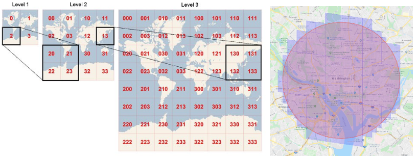
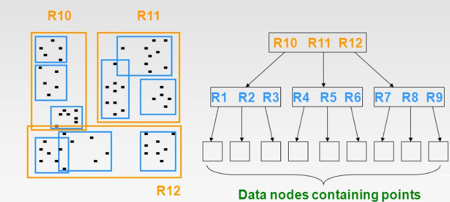
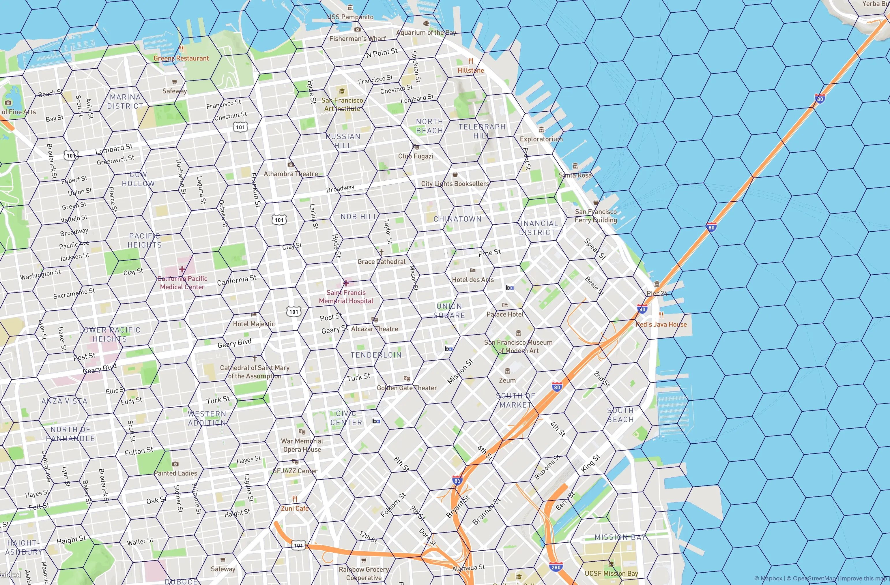

# About Geo Spatial Index's

<!--Writerside adds this topic when you create a new documentation project.
You can use it as a sandbox to play with Writerside features, and remove it from the TOC when you don't need it anymore.-->

## What are Geo Spatial Index's?
These are special database structures for storing and retrieving data based on their geographical region

{ width=290, border-effect=line}

## Why are these needed?
Some businesses are based on who, what, and where things are located in the physical world, and 
how fast you're able to retrieve, create, and modify that data has a huge impact on customer satisfaction.
So in order to satisfy the customer and solve real world problems in a quick and useful manner we 
need to have performant ways of accessing data in our databases. This is why we need to have geo-spatial
index's.

## Types of Geospatial Indexes: {.tabset .tabset-fade}

### Tree Based
Organize spatial data in a hierarchical way, allowing for efficient searches by dividing the space into segments
{ width=290, border-effect=line}

### Grid Based

Divide space into a grid of cells, allowing for identifying nearby objects or regions
{ width=290, border-effect=line}


### Comprehensive list of geospatial indexes
There are many different types of Geo Spatial indexes here is a list of each of the major ones that
you'll see in industry:

#### Grid-base spatial index {collapsible="true" default-state="expanded"}
Commonly used in file geodatabases and in other geodatabases like Db2 and Oracle

#### R-tree spatial index {collapsible="true" default-state="expanded"}
Balanced tree data structure that represents bounding rectangles of spatial objects. R-Trees
are flexible and can be used for both two-dimensional and higher dimensional data. It groups
spatial objects hierarchically based on their bounding rectangles.
```Python
class GFG:
    def __init_= maxY  # Maximum y-coordinate
        self.paren_(self, minX, maxX, minY, maxY, parent):
        """
        Constructor to initialize a GFG node.
        """
        self.minX = minX  # Minimum x-coordinate
        self.maxX = maxX  # Maximum x-coordinate
        self.minY = minY  # Minimum y-coordinate
        self.maxY t = parent  # Parent node
        self.children = []  # List of child nodes

class RTree:
    def __init__(self):
        """
        Constructor to initialize an R-Tree.
        """
        self.root = None  # Root node of the R-Tree

    def insert(self, minX, maxX, minY, maxY):
        """
        Method to insert a rectangle into the R-Tree.
        """
        self.root = self._insert(self.root, minX, maxX, minY, maxY, None)

    def search(self, x, y):
        """
        Method to search for a point in the R-Tree.
        """
        return self._search(self.root, x, y)

    def _insert(self, node, minX, maxX, minY, maxY, parent):
        """
        Internal method to recursively insert a rectangle into the R-Tree.
        """
        if not node:
            # If node is None, create a new node
            return GFG(minX, maxX, minY, maxY, parent)
        
        if not node.children:
            # If node has no children, create a new child node
            new_node = GFG(minX, maxX, minY, maxY, node.parent)
            node.children.append(new_node)
            return new_node
        
        # Calculate the enlargement of the potential child nodes
        min_enlargement = float('inf')
        best_child = None
        
        for child in node.children:
            newMinX = min(child.minX, minX)
            newMaxX = max(child.maxX, maxX)
            newMinY = min(child.minY, minY)
            newMaxY = max(child.maxY, maxY)
            enlargement = (newMaxX - newMinX) * (newMaxY - newMinY) - (child.maxX - child.minX) * (child.maxY - child.minY)
            
            if enlargement < min_enlargement:
                min_enlargement = enlargement
                best_child = child
        
        # Recursively insert the rectangle into the best child node
        self._insert(best_child, minX, maxX, minY, maxY, node)
        return node

    def _search(self, node, x, y):
        """
        Internal method to recursively search for a point in the R-Tree.
        """
        if not node:
            # If node is None, return False
            return False
        
        if not node.children:
            # If node has no children, check if the point lies within the node's boundaries
            return x >= node.minX and x <= node.maxX and y >= node.minY and y <= node.maxY
        
        for child in node.children:
            # Recursively search for the point in each child node
            if x >= child.minX and x <= child.maxX and y >= child.minY and y <= child.maxY:
                return self._search(child, x, y)
        
        return False

def main():
    # Create an instance of the R-Tree
    rtree = RTree()

    # Insert rectangles into the R-Tree
    rtree.insert(7.0, 20.0, 5.0, 10.0)
    rtree.insert(30.0, 35.0, 15.0, 20.0)

    # Search for points in the R-Tree
    x, y = 7.0, 7.0
    print("Search Result for (", x, ",", y, "):", "Found" if rtree.search(x, y) else "Not Found")
    x, y = 23.0, 19.0
    print("Search Result for (", x, ",", y, "):", "Found" if rtree.search(x, y) else "Not Found")

if __name__ == "__main__":
    main()
#this code is contributed by Monu.
```

#### GiST (Generalized Search Tree) index {collapsible="true" default-state="expanded"}
Used in geodatabases in Oracle

#### Modified B-tree spatial index {collapsible="true" default-state="expanded"}
Used in geodatabases in Microsoft SQL Server, especially for Geometry and
Geography spatial columns

#### Geohash {collapsible="true" default-state="expanded"}
A technique that converts geographic coordinates into a single-string representation
for efficient indexing and search
```Python
class GeoHashExample:
    base32 = "0123456789bcdefghjkmnpqrstuvwxyz"

    @staticmethod
    def encode(latitude, longitude, precision):
        minLat, maxLat = -90.0, 90.0
        minLon, maxLon = -180.0, 180.0
        hash_code = ""
        is_even = True
        bit = 0
        ch = 0

        while len(hash_code) < precision:
            mid = 0.0
            if is_even:
                mid = (minLon + maxLon) / 2
                if longitude > mid:
                    ch |= (1 << (4 - bit))
                    minLon = mid
                else:
                    maxLon = mid
            else:
                mid = (minLat + maxLat) / 2
                if latitude > mid:
                    ch |= (1 << (4 - bit))
                    minLat = mid
                else:
                    maxLat = mid

            is_even = not is_even
            if bit < 4:
                bit += 1
            else:
                hash_code += GeoHashExample.base32[ch]
                bit = 0
                ch = 0

        return hash_code

    @staticmethod
    def decode(geohash):
        minLat, maxLat = -90.0, 90.0
        minLon, maxLon = -180.0, 180.0
        is_even = True
        for ch in geohash:
            cd = GeoHashExample.base32_index(ch)
            for i in range(4, -1, -1):
                mask = 1 << i
                if is_even:
                    GeoHashExample.divide_range_decode(minLon, maxLon, cd & mask, longitude)
                else:
                    GeoHashExample.divide_range_decode(minLat, maxLat, cd & mask, latitude)
                is_even = not is_even

    @staticmethod
    def base32_index(ch):
        if '0' <= ch <= '9':
            return ord(ch) - ord('0')
        elif 'b' <= ch <= 'h':
            return ord(ch) - ord('b') + 10
        elif 'j' <= ch <= 'n':
            return ord(ch) - ord('j') + 17
        elif 'p' <= ch <= 'z':
            return ord(ch) - ord('p') + 22
        else:
            return 0

    @staticmethod
    def divide_range_decode(min_value, max_value, b, value):
        mid = (min_value + max_value) / 2
        if b == 0:
            max_value = mid
        else:
            min_value = mid
        value[0] = (min_value + max_value) / 2


geohash = "9q8yywh"
latitude = [0.0]
longitude = [0.0]
GeoHashExample.decode(geohash)
print("Latitude:", latitude[0], ", Longitude:", longitude[0])
```

#### H3 {collapsible="true" default-state="expanded"}
A hexagonal Spatial Index, available in 16 different resolutions, with the smallest covering
an area of 0.9m<sup>2</sup>, reaching up to and 4.3 million km<sup>2</sup> at the largest 
resolution. Unliked standard hexagonal grids, H3 maps the spherical earth rather than being limited to
a smaller plane of an area.

H3 has a number of advantages for spatial analysis over other Spatial Indexes, primarily due to it's 
hexagonal shape - which is the closest of the three to a circle:

- The distance between the centroid of a hexagon to all neighboring centroids is the same in all directions
- The lack of acute angles in a regular hexagon means that no areas of the shape are outliers in any direction
- All neighboring hexagons have the same spatial relationship with the central hexagon, making spatial querying and joining a more straight forward process
- Unlike square-based grids, the geometry of hexagons is well-structured to represent curves of geographic features which are rarely perpendicular, such as rivers and roads.
- The "softer" shape of a hexagon compared to a square means it performs better at representing gradual spatial changes and movement in particular

#### Redis geospatial indexing {collapsible="true" default-state="expanded"}
Redis provides geospatial indexing capabilities for efficient storage and retrieval of
location-based data

#### Quadbin {collapsible="true" default-state="expanded"}
An encoding format for [Quadkey](https://learn.microsoft.com/en-us/bingmaps/articles/bing-maps-tile-system),
and is a square-based hierarchy with 26 resolutions. At the most coarse level, the world is
split into four quadkey cells, each with an index reference such as "48a2d06affffffff". At the next
level down, each of these is further reaching the most detailed resolution which measures less than 1m<sup>2</sup>  
at the equator of the earth. This system is known as a [Quadtree](Geo Spatial Index's.md#quadtree) key. The rectangular
nature of a Quadbin system makes it particularly suited for modeling [perpendicular](https://dictionary.cambridge.org/us/dictionary/english/perpendicular) 
geographies, such as a gridded street system.

#### Quadtree {collapsible="true" default-state="expanded"}
Hierarchical tree data structure that recursively subdivides a 2D space into quadrants. 
Each node in a quadtree represents a quadrant containing one or more spatial objects. 
Quadtree is mainly used for two-dimensional data
```Python
# Used to hold details of a point
class Point:
    def __init__(self, x, y):
        self.x = x
        self.y = y

# The objects that we want stored in the quadtree
class Node:
    def __init__(self, pos, data):
        self.pos = pos
        self.data = data

# The main quadtree class
class Quad:
    def __init__(self, topL, botR):
        self.topLeft = topL
        self.botRight = botR
        self.n = None
        self.topLeftTree = None
        self.topRightTree = None
        self.botLeftTree = None
        self.botRightTree = None

    # Insert a node into the quadtree
    def insert(self, node):
        if node is None:
            return

        # Current quad cannot contain it
        if not self.inBoundary(node.pos):
            return

        # We are at a quad of unit area
        # We cannot subdivide this quad further
        if abs(self.topLeft.x - self.botRight.x) <= 1 and abs(self.topLeft.y - self.botRight.y) <= 1:
            if self.n is None:
                self.n = node
            return

        if (self.topLeft.x + self.botRight.x) / 2 >= node.pos.x:
            # Indicates topLeftTree
            if (self.topLeft.y + self.botRight.y) / 2 >= node.pos.y:
                if self.topLeftTree is None:
                    self.topLeftTree = Quad(self.topLeft, Point((self.topLeft.x + self.botRight.x) / 2, (self.topLeft.y + self.botRight.y) / 2))
                self.topLeftTree.insert(node)
            # Indicates botLeftTree
            else:
                if self.botLeftTree is None:
                    self.botLeftTree = Quad(Point(self.topLeft.x, (self.topLeft.y + self.botRight.y) / 2), Point((self.topLeft.x + self.botRight.x) / 2, self.botRight.y))
                self.botLeftTree.insert(node)
        else:
            # Indicates topRightTree
            if (self.topLeft.y + self.botRight.y) / 2 >= node.pos.y:
                if self.topRightTree is None:
                    self.topRightTree = Quad(Point((self.topLeft.x + self.botRight.x) / 2, self.topLeft.y), Point(self.botRight.x, (self.topLeft.y + self.botRight.y) / 2))
                self.topRightTree.insert(node)
            # Indicates botRightTree
            else:
                if self.botRightTree is None:
                    self.botRightTree = Quad(Point((self.topLeft.x + self.botRight.x) / 2, (self.topLeft.y + self.botRight.y) / 2), self.botRight)
                self.botRightTree.insert(node)

    # Find a node in a quadtree
    def search(self, p):
        # Current quad cannot contain it
        if not self.inBoundary(p):
            return 0  # Return 0 if point is not found

        # We are at a quad of unit length
        # We cannot subdivide this quad further
        if self.n is not None:
            return self.n

        if (self.topLeft.x + self.botRight.x) / 2 >= p.x:
            # Indicates topLeftTree
            if (self.topLeft.y + self.botRight.y) / 2 >= p.y:
                if self.topLeftTree is None:
                    return 0
                return self.topLeftTree.search(p)
            # Indicates botLeftTree
            else:
                if self.botLeftTree is None:
                    return 0
                return self.botLeftTree.search(p)
        else:
            # Indicates topRightTree
            if (self.topLeft.y + self.botRight.y) / 2 >= p.y:
                if self.topRightTree is None:
                    return 0
                return self.topRightTree.search(p)
            # Indicates botRightTree
            else:
                if self.botRightTree is None:
                    return 0
                return self.botRightTree.search(p)

    # Check if current quadtree contains the point
    def inBoundary(self, p):
        return p.x >= self.topLeft.x and p.x <= self.botRight.x and p.y >= self.topLeft.y and p.y <= self.botRight.y

# Driver program
center = Quad(Point(0, 0), Point(8, 8))
a = Node(Point(1, 1), 1)
b = Node(Point(2, 5), 2)
c = Node(Point(7, 6), 3)
center.insert(a)
center.insert(b)
center.insert(c)
print("Node a:", center.search(Point(1, 1)).data)
print("Node b:", center.search(Point(2, 5)).data)
print("Node c:", center.search(Point(7, 6)).data)
print("Non-existing node:", center.search(Point(5, 5)))

# This code is contributed by arindam369
```


#### KD Tree {collapsible="true" default-state="expanded"}
Used for organizing points in k-dimensional space. It's primarily used for efficient 
range searches and nearest neighbor searches in multi-dimensional datasets
```Python
import math

class Point:
    def __init__(self, x, y):
        self.x = x
        self.y = y

class Node:
    def __init__(self, point):
        self.point = point
        self.left = None
        self.right = None

class Tree:
    def __init__(self, points):
        self.root = self.build_tree(points, 0)
    
    def build_tree(self, points, depth):
        if not points:
            return None
        
        axis = depth % 2
        median = len(points) // 2
        
        # Sort based on the axis
        sorted_points = sorted(points, key=lambda p: (p.x, p.y)[axis])
        
        node = Node(sorted_points[median])
        node.left = self.build_tree(sorted_points[:median], depth + 1)
        node.right = self.build_tree(sorted_points[median + 1:], depth + 1)
        
        return node
    
    def search(self, target):
        return self._search(self.root, target, 0)
    
    def _search(self, node, target, depth):
        if not node or (node.point.x == target.x and node.point.y == target.y):
            return node
        
        axis = depth % 2
        if (axis == 0 and target.x < node.point.x) or (axis == 1 and target.y < node.point.y):
            return self._search(node.left, target, depth + 1)
        return self._search(node.right, target, depth + 1)

if __name__ == "__main__":
    points = [Point(2, 3), Point(5, 4), Point(9, 4), Point(4, 7), Point(8, 1), Point(7, 2)]
    
    kdtree = Tree(points)
    target = Point(5, 4)
    
    result = kdtree.search(target)
    
    if result:
        print(f"Found point at ({result.point.x}, {result.point.y})")
    else:
        print("Point not found!")
        
# This code is contributed by shivamgupta310570
```


#### S2 {collapsible="true" default-state="expanded"}
A heirarch of quadrilaterals ranging from 0 -> 30, the smallest of which has a resolution of 
just 1cm<sup>2</sup>. The key differentiator of S2 is that it represents data on a three-dimensional
sphere. In contrast, both H3 and Quadbin represent data using the [Mercator coordinate system](https://pro.arcgis.com/en/pro-app/latest/help/mapping/properties/mercator.htm)
which is a spherical coordinate system. They cylindrical technique is a way of representing the bumpy
and spherical (ish!) world in a 2D computer screen as if a sheet of paper were wrapped around the earth
in a cylinder. This means that there is less distortion in S2 (compared to H3 and Quadbin) around extreme 
latitudes. S2 is also not affected by the break at the 180&deg; longitude.

#### Geospatial Tools {collapsible="true" default-state="expanded"}
Platforms like ArcGIS Pro, ArcGIS, FME Desktop, and others provide various spatial
indexing and analysis capabilities